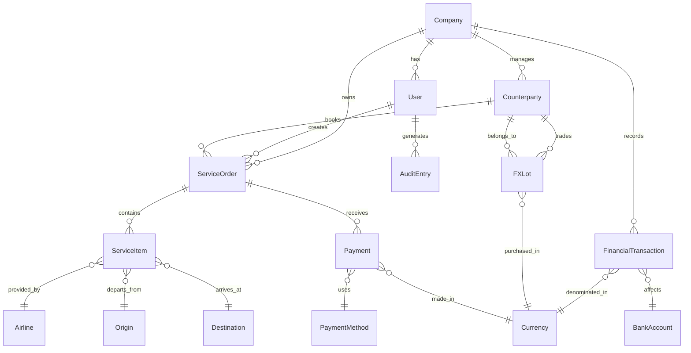
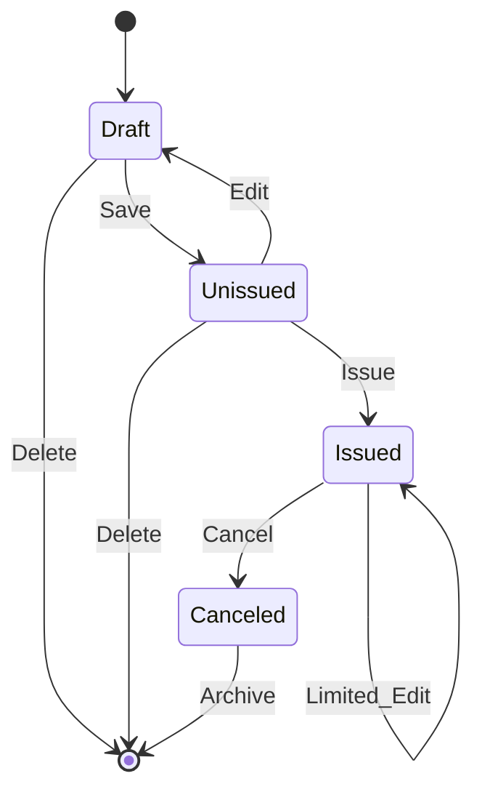
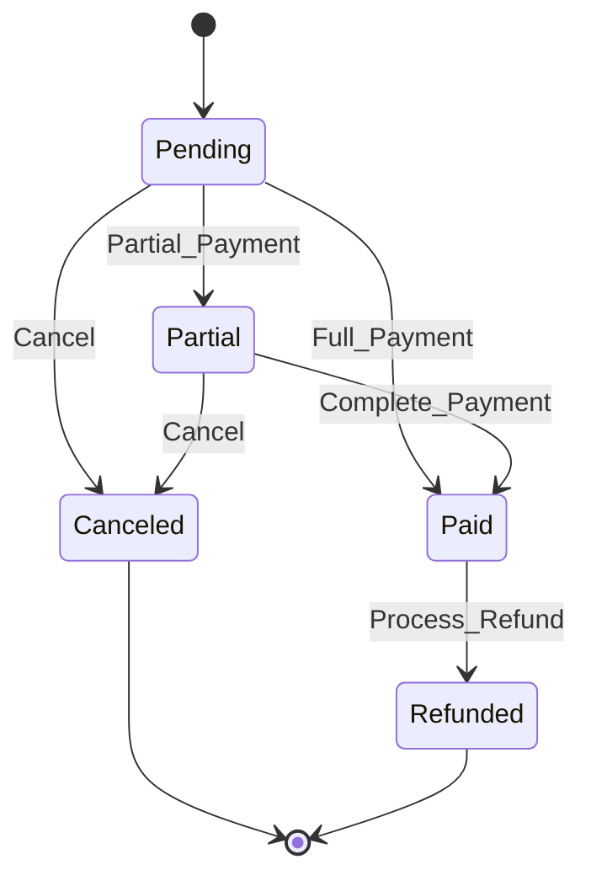
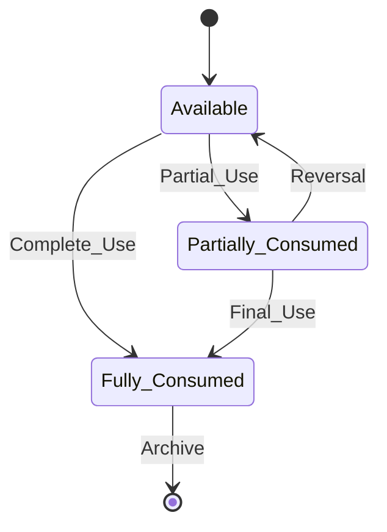

# Travel Agency Accounting System - Comprehensive Product Requirements Document (PRD)

## Executive Summary

The Travel Agency Accounting System is a comprehensive back-office web application designed for travel agencies to manage ticketing, financial transactions, and accounting operations. The system supports multi-currency operations, FIFO foreign exchange lot tracking, document workflow management, and comprehensive reporting capabilities with Persian calendar support.

### Key Business Objectives
- Streamline travel agency operations from booking to financial reconciliation
- Provide accurate multi-currency accounting with FX lot tracking
- Enable comprehensive reporting and audit trails
- Support Persian/Jalali calendar operations
- Ensure data integrity and financial compliance

---

## Product Requirements Document (PRD)

### 1. System Overview

**Product Name:** Travel Agency Accounting System  
**Version:** 1.0  
**Target Users:** Travel agency staff, accountants, managers  
**Platform:** Web-based SPA (Single Page Application)  
**Technology Stack:** Vue.js 3 + .NET 8 + SQL Server + Docker  

### 2. Functional Requirements

#### 2.1 Authentication & Authorization
- **Multi-tenant company-scoped access**
- **Role-based access control (RBAC)**
- **JWT + Cookie hybrid authentication**
- **Captcha verification for login attempts**
- **Account lockout after failed attempts**
- **Password complexity requirements**

**Acceptance Criteria:**
- Users can only access data within their company scope
- Role permissions are enforced at API and UI levels
- Session management with automatic timeout
- Audit logging for all authentication events

#### 2.2 Document Management System

##### 2.2.1 Sales Documents (Tickets/Services)
**Service Types:**
- Air Tickets
- Train/Bus Tickets
- Hotel Bookings
- Tour Packages
- Mixed/Combo Bookings

**Document States:**
- **Unissued:** Editable, can be modified or deleted
- **Issued:** Finalized, limited editing allowed
- **Canceled:** Final state, read-only with cancellation details

**Acceptance Criteria:**
- Unique document numbers generated only on successful save
- State transitions follow business rules
- Audit trail for all document changes
- Color-coded UI based on flight dates (red if within 5 days)

##### 2.2.2 Financial Documents
**Document Types:**
- Vouchers (Receipts/Payments)
- Cost Transactions
- Income Transactions
- Inter-account Transfers

#### 2.3 Multi-Currency & FX Management

##### 2.3.1 Currency Support
- **Primary Currency:** Iranian Rial (IRR)
- **Foreign Currencies:** USD, EUR, AED, etc.
- **Exchange Rate Management:** Historical rates with timestamps
- **Currency Precision:** 4 decimal places for calculations

##### 2.3.2 FX Lot Tracking (FIFO)
**Requirements:**
- FIFO consumption per counterparty
- Lot-based inventory tracking
- Realized/unrealized gain calculations
- Running valuation in local currency

**Acceptance Criteria:**
- FX lots consumed in chronological order (FIFO)
- Accurate profit/loss calculations on FX transactions
- Detailed FX position reports
- Edge case handling (partial lot consumption, zero-value lots)

#### 2.4 Financial Management

##### 2.4.1 Accounts Receivable (A/R)
- Customer payment tracking
- Aging reports
- Payment allocation to invoices
- Credit limit management

##### 2.4.2 Accounts Payable (A/P)
- Supplier payment management
- Payment scheduling
- Vendor statement reconciliation
- Early payment discounts

##### 2.4.3 Banking & Reconciliation
- Multiple bank account support
- Transaction import/export
- Bank statement reconciliation
- Payment gateway integration

#### 2.5 Reporting System

**Report Categories:**
- **Financial Reports:** P&L, Balance Sheet, Cash Flow
- **Operational Reports:** Ticket status, passenger manifests
- **Analytical Reports:** FX positions, counterparty analysis
- **Audit Reports:** Change logs, user activity

**Export Formats:**
- PDF generation
- Excel export
- CSV data export
- Print-friendly formats

**Acceptance Criteria:**
- Real-time data in reports
- Customizable date ranges and filters
- Role-based report access
- Scheduled report generation

#### 2.6 Master Data Management

**Entity Types:**
- Companies (Multi-tenant)
- Users and Roles
- Counterparties (Customers/Suppliers)
- Airlines and Service Providers
- Banks and Payment Methods
- Chart of Accounts
- Origins and Destinations

---

## Entity Relationship Diagram (ERD)

### Core Entities



### Detailed Entity Specifications

#### Company
- CompanyId (PK)
- Name, TaxId, Address
- DefaultCurrency
- CreatedAt, IsActive

#### User
- UserId (PK)
- CompanyId (FK)
- Username, PasswordHash
- Email, FullName
- RoleId (FK)
- LastLoginAt, IsActive

#### ServiceOrder (Main Document)
- OrderId (PK)
- CompanyId (FK)
- DocumentNumber (Unique per company)
- OrderDate, Status (Unissued/Issued/Canceled)
- CounterpartyId (FK)
- TotalAmount, Currency
- CreatedBy, CreatedAt, ModifiedAt

#### ServiceItem (Ticket/Hotel/Tour Details)
- ItemId (PK)
- OrderId (FK)
- ServiceType (Air/Train/Hotel/Tour)
- AirlineId (FK), OriginId (FK), DestinationId (FK)
- ServiceDate, PassengerName
- Amount, Currency
- Status, CancellationReason

#### FXLot (Foreign Exchange Inventory)
- LotId (PK)
- CompanyId (FK), CounterpartyId (FK)
- Currency, PurchaseAmount
- ExchangeRate, LocalAmount
- PurchaseDate, RemainingAmount
- IsFullyConsumed

---

## State Machines

### 1. Document State Machine



**State Transition Rules:**
- **Draft → Unissued:** Document number assigned, validation passed
- **Unissued → Issued:** Final confirmation, payment received
- **Issued → Canceled:** Cancellation with reason, refund processing
- **Limited Edit in Issued:** Only non-critical fields (notes, contact info)

### 2. Payment State Machine



### 3. FX Lot State Machine



---

## FX Lot Algorithm Specification

### FIFO Consumption Algorithm

```pseudocode
FUNCTION ConsumeFXLots(counterpartyId, currency, requiredAmount):
    lots = GetAvailableLots(counterpartyId, currency) 
           ORDER BY PurchaseDate ASC
    
    remainingAmount = requiredAmount
    consumedLots = []
    
    FOR each lot IN lots:
        IF remainingAmount <= 0:
            BREAK
            
        availableInLot = lot.RemainingAmount
        consumeFromLot = MIN(remainingAmount, availableInLot)
        
        // Calculate proportional local currency value
        localValue = (consumeFromLot / lot.PurchaseAmount) * lot.LocalAmount
        
        // Record consumption
        consumption = {
            LotId: lot.LotId,
            ConsumedAmount: consumeFromLot,
            LocalValue: localValue,
            ExchangeRate: lot.ExchangeRate
        }
        
        consumedLots.ADD(consumption)
        
        // Update lot
        lot.RemainingAmount -= consumeFromLot
        IF lot.RemainingAmount = 0:
            lot.IsFullyConsumed = TRUE
            
        remainingAmount -= consumeFromLot
    
    IF remainingAmount > 0:
        THROW InsufficientFXInventoryException
        
    RETURN consumedLots
```

### Edge Cases Handled
1. **Partial Lot Consumption:** Lots can be partially consumed across multiple transactions
2. **Zero-Value Lots:** Lots with zero remaining amount are skipped
3. **Insufficient Inventory:** Exception thrown when required amount exceeds available lots
4. **Concurrent Access:** Optimistic locking prevents double-consumption
5. **Reversal Transactions:** Consumed amounts can be returned to lots in reverse order

### Mathematical Precision
- All calculations use `decimal(18,4)` precision
- Rounding rules: Banker's rounding for financial calculations
- Currency conversion: Rate * Amount with 4 decimal precision
- Lot valuation: Weighted average cost method

---

## Role-Based Access Control (RBAC) Matrix

### Roles Definition

| Role | Description | Scope |
|------|-------------|-------|
| **Super Admin** | System administrator | Cross-company |
| **Company Admin** | Company-level administrator | Single company |
| **Manager** | Department manager | Department-level |
| **Accountant** | Financial operations | Finance modules |
| **Agent** | Sales operations | Sales modules |
| **Viewer** | Read-only access | Limited viewing |

### Permission Matrix

| Module/Action | Super Admin | Company Admin | Manager | Accountant | Agent | Viewer |
|---------------|-------------|---------------|---------|------------|-------|--------|
| **User Management** |
| Create Users | ✅ | ✅ | ❌ | ❌ | ❌ | ❌ |
| Edit Users | ✅ | ✅ | ❌ | ❌ | ❌ | ❌ |
| Delete Users | ✅ | ✅ | ❌ | ❌ | ❌ | ❌ |
| View Users | ✅ | ✅ | ✅ | ❌ | ❌ | ❌ |
| **Sales Documents** |
| Create Orders | ✅ | ✅ | ✅ | ❌ | ✅ | ❌ |
| Edit Unissued | ✅ | ✅ | ✅ | ❌ | ✅ | ❌ |
| Issue Orders | ✅ | ✅ | ✅ | ✅ | ✅ | ❌ |
| Cancel Orders | ✅ | ✅ | ✅ | ✅ | ❌ | ❌ |
| View Orders | ✅ | ✅ | ✅ | ✅ | ✅ | ✅ |
| **Financial Operations** |
| Create Vouchers | ✅ | ✅ | ✅ | ✅ | ❌ | ❌ |
| Approve Payments | ✅ | ✅ | ✅ | ✅ | ❌ | ❌ |
| Bank Reconciliation | ✅ | ✅ | ✅ | ✅ | ❌ | ❌ |
| View Financials | ✅ | ✅ | ✅ | ✅ | ❌ | ✅ |
| **Reports** |
| Financial Reports | ✅ | ✅ | ✅ | ✅ | ❌ | ✅ |
| Operational Reports | ✅ | ✅ | ✅ | ✅ | ✅ | ✅ |
| Audit Reports | ✅ | ✅ | ✅ | ❌ | ❌ | ❌ |
| Export Data | ✅ | ✅ | ✅ | ✅ | ❌ | ❌ |
| **Master Data** |
| Manage Airlines | ✅ | ✅ | ✅ | ❌ | ❌ | ❌ |
| Manage Banks | ✅ | ✅ | ✅ | ✅ | ❌ | ❌ |
| Manage Counterparties | ✅ | ✅ | ✅ | ✅ | ✅ | ❌ |
| View Master Data | ✅ | ✅ | ✅ | ✅ | ✅ | ✅ |

### Permission Implementation
- **Attribute-based authorization** in .NET controllers
- **Frontend route guards** based on user roles
- **API endpoint protection** with role requirements
- **Dynamic UI rendering** based on permissions

---

## Reports Catalogue

### 1. Financial Reports

#### Profit & Loss Statement
**Filters:**
- Date Range (From/To)
- Currency (IRR/USD/EUR/All)
- Department/Cost Center
- Service Type

**Aggregations:**
- Revenue by service type
- Costs by category
- Gross profit margins
- Net profit/loss
- Month-over-month comparison

#### Balance Sheet
**Filters:**
- As of Date
- Currency view
- Consolidation level

**Sections:**
- Assets (Cash, A/R, FX Inventory)
- Liabilities (A/P, Accruals)
- Equity (Capital, Retained Earnings)

#### Cash Flow Statement
**Categories:**
- Operating Activities
- Investing Activities
- Financing Activities
- Net Cash Flow

### 2. Operational Reports

#### Ticket Status Report
**Filters:**
- Date Range
- Status (Unissued/Issued/Canceled)
- Airline
- Origin/Destination
- Agent

**Columns:**
- Document Number
- Passenger Name
- Itinerary
- Service Date
- Amount
- Status
- Days to Travel (for color coding)

#### Passenger Manifest
**Filters:**
- Flight Date
- Airline
- Route

**Output:**
- Passenger list by flight
- Age group breakdown
- Special requirements
- Contact information

### 3. Financial Analysis Reports

#### FX Position Report
**Filters:**
- Currency
- Counterparty
- Date Range

**Metrics:**
- Opening balance
- Purchases/Sales
- Realized gains/losses
- Unrealized gains/losses
- Closing position

#### Accounts Receivable Aging
**Aging Buckets:**
- Current (0-30 days)
- 31-60 days
- 61-90 days
- Over 90 days

**Analysis:**
- Customer-wise breakdown
- Collection probability
- Bad debt provisions

### 4. Audit & Compliance Reports

#### Audit Trail Report
**Filters:**
- User
- Date Range
- Entity Type
- Action Type

**Details:**
- Timestamp
- User
- Action performed
- Before/After values
- IP Address

#### User Activity Report
**Metrics:**
- Login frequency
- Module usage
- Document creation/modification
- Failed login attempts

### Export Capabilities
- **PDF:** Formatted reports with company branding
- **Excel:** Raw data with pivot tables
- **CSV:** Data export for external analysis
- **Print:** Optimized print layouts

---

## Non-Functional Requirements

### 1. Performance Requirements

#### Response Time
- **Page Load:** < 2 seconds for initial load
- **API Calls:** < 500ms for CRUD operations
- **Reports:** < 5 seconds for standard reports
- **Search:** < 1 second for typeahead results

#### Throughput
- **Concurrent Users:** Support 50+ concurrent users per company
- **Transaction Volume:** Handle 1000+ documents per day
- **Database:** Support 1M+ records with acceptable performance

#### Scalability
- **Horizontal Scaling:** Stateless API design for load balancing
- **Database Scaling:** Read replicas for reporting
- **Caching:** Redis for session and frequently accessed data

### 2. Pagination & Data Management

#### List Views
- **Page Size:** 25/50/100 records per page
- **Virtual Scrolling:** For large datasets (1000+ records)
- **Server-side Filtering:** Reduce data transfer
- **Lazy Loading:** Load data on demand

#### Search Optimization
- **Full-text Search:** Indexed search on key fields
- **Autocomplete:** Typeahead with debouncing
- **Search History:** Recent searches for users

### 3. Concurrency & Locking

#### Document Numbering
- **Atomic Operations:** Database sequences for unique numbers
- **Retry Logic:** Handle concurrent number generation
- **Gap Handling:** Minimize number gaps from failed transactions

#### Optimistic Locking
- **Version Control:** Row versioning for concurrent edits
- **Conflict Resolution:** User-friendly conflict messages
- **Last-writer-wins:** For non-critical fields

#### Pessimistic Locking
- **Financial Transactions:** Lock during payment processing
- **FX Lot Consumption:** Prevent double-spending
- **Document Finalization:** Lock during state transitions

### 4. Internationalization (i18n)

#### Calendar Support
- **Persian/Jalali Calendar:** Primary calendar system
- **Gregorian Calendar:** Secondary support
- **Date Conversion:** Seamless conversion between calendars
- **Localized Formatting:** Persian number formatting

#### Language Support
- **Persian (Farsi):** Primary language
- **English:** Secondary language
- **RTL Support:** Right-to-left text direction
- **Number Formatting:** Persian numerals and separators

#### Regional Settings
- **Timezone:** Iran Standard Time (IRST)
- **Currency:** Iranian Rial with proper formatting
- **Date Formats:** Persian date patterns

### 5. Accessibility (WCAG 2.1)

#### Level AA Compliance
- **Keyboard Navigation:** Full keyboard accessibility
- **Screen Reader:** ARIA labels and descriptions
- **Color Contrast:** Minimum 4.5:1 ratio
- **Focus Management:** Visible focus indicators

#### Responsive Design
- **Mobile Support:** Responsive layouts for tablets/phones
- **Touch Targets:** Minimum 44px touch targets
- **Viewport:** Proper viewport meta tags

### 6. Security & Privacy

#### Data Protection
- **PII Encryption:** Encrypt sensitive personal data
- **Data Masking:** Mask sensitive data in logs
- **GDPR Compliance:** Data retention and deletion policies
- **Audit Logging:** Comprehensive audit trails

#### Authentication Security
- **Password Policy:** Strong password requirements
- **Session Management:** Secure session handling
- **Rate Limiting:** Prevent brute force attacks
- **Two-Factor Authentication:** Optional 2FA support

#### API Security
- **JWT Tokens:** Secure token-based authentication
- **CORS Policy:** Restrict cross-origin requests
- **Input Validation:** Prevent injection attacks
- **HTTPS Only:** Force secure connections

### 7. Logging & Monitoring

#### Application Logging
- **Structured Logging:** JSON-formatted logs
- **Log Levels:** Debug, Info, Warning, Error, Critical
- **Correlation IDs:** Track requests across services
- **Performance Metrics:** Response times and throughput

#### Business Logging
- **User Actions:** Log all business-critical actions
- **Financial Transactions:** Detailed transaction logging
- **System Events:** Login/logout, configuration changes
- **Error Tracking:** Detailed error information

#### Monitoring & Alerting
- **Health Checks:** API and database health monitoring
- **Performance Monitoring:** Real-time performance metrics
- **Error Alerting:** Immediate notification of critical errors
- **Capacity Planning:** Resource usage tracking

### 8. Backup & Recovery

#### Data Backup
- **Daily Backups:** Automated daily database backups
- **Point-in-time Recovery:** Transaction log backups
- **Offsite Storage:** Cloud backup storage
- **Backup Testing:** Regular restore testing

#### Disaster Recovery
- **RTO:** Recovery Time Objective < 4 hours
- **RPO:** Recovery Point Objective < 1 hour
- **Failover:** Automated failover procedures
- **Documentation:** Detailed recovery procedures

### 9. File Storage & Management

#### Document Storage
- **File Types:** PDF, Excel, images, documents
- **Storage Location:** Cloud storage (Azure Blob/AWS S3)
- **File Size Limits:** 10MB per file, 100MB per document
- **Virus Scanning:** Automated malware detection

#### File Organization
- **Folder Structure:** Organized by company/year/month
- **Naming Convention:** Standardized file naming
- **Metadata:** File tags and descriptions
- **Access Control:** Role-based file access

### 10. Audit Retention

#### Retention Policies
- **Financial Data:** 7 years minimum retention
- **Audit Logs:** 3 years retention
- **User Activity:** 1 year retention
- **System Logs:** 6 months retention

#### Archival Process
- **Automated Archival:** Move old data to archive storage
- **Compressed Storage:** Reduce storage costs
- **Retrieval Process:** On-demand data retrieval
- **Legal Hold:** Prevent deletion during legal proceedings

---

## Integration Requirements

### 1. Banking & Payment Integration

#### Bank Reconciliation
- **Statement Import:** Support multiple bank formats (CSV, Excel, MT940)
- **Automatic Matching:** Match transactions with internal records
- **Exception Handling:** Flag unmatched transactions
- **Reconciliation Reports:** Detailed reconciliation summaries

#### Payment Gateway Integration
- **Supported Gateways:** Local Iranian payment processors
- **Real-time Processing:** Immediate payment confirmation
- **Webhook Handling:** Process payment notifications
- **Refund Processing:** Automated refund capabilities

#### POS Integration
- **Terminal Integration:** Connect with POS terminals
- **Transaction Sync:** Real-time transaction synchronization
- **Receipt Management:** Digital receipt storage
- **Settlement Reports:** Daily settlement reconciliation

### 2. Foreign Exchange Integration

#### FX Rate Providers
- **Central Bank Rates:** Iran Central Bank official rates
- **Commercial Rates:** Real-time market rates
- **Rate History:** Historical rate storage
- **Rate Alerts:** Notification of significant rate changes

#### Rate Management
- **Manual Override:** Allow manual rate entry
- **Rate Validation:** Validate rates against market ranges
- **Effective Dating:** Time-based rate application
- **Audit Trail:** Track all rate changes

### 3. Vendor API Integration

#### Airline APIs
- **GDS Integration:** Connect with Global Distribution Systems
- **Fare Verification:** Real-time fare checking
- **Booking Confirmation:** Automated booking confirmations
- **Schedule Updates:** Flight schedule synchronization

#### Hotel APIs
- **Property Management:** Hotel inventory integration
- **Rate Management:** Real-time rate updates
- **Booking Engine:** Direct booking capabilities
- **Availability Checking:** Real-time availability

### 4. Communication Integration

#### SMS Integration
- **Booking Confirmations:** Send booking confirmations via SMS
- **Payment Reminders:** Automated payment reminders
- **Flight Alerts:** Flight status notifications
- **Bulk Messaging:** Marketing and promotional messages

#### Email Integration
- **SMTP Configuration:** Support multiple email providers
- **Template Management:** Customizable email templates
- **Automated Emails:** Booking confirmations, invoices
- **Email Tracking:** Delivery and open tracking

### 5. Captcha Integration

#### Captcha Providers
- **Google reCAPTCHA:** Primary captcha service
- **Local Captcha:** Fallback captcha system
- **Accessibility:** Audio captcha for visually impaired
- **Mobile Optimization:** Touch-friendly captcha

#### Implementation
- **Login Protection:** Captcha after failed attempts
- **Form Protection:** Protect sensitive forms
- **API Protection:** Rate limiting with captcha
- **Configuration:** Adjustable captcha sensitivity

---

## Architecture Recommendations

### 1. System Architecture

#### Recommended Approach: **Modular Monolith**

**Rationale:**
- **Simplicity:** Easier deployment and maintenance
- **Performance:** Lower latency than microservices
- **Development Speed:** Faster initial development
- **Team Size:** Suitable for small to medium teams

**Architecture Components:**
```
┌─────────────────────────────────────────┐
│              Load Balancer              │
└─────────────────┬───────────────────────┘
                  │
┌─────────────────▼───────────────────────┐
│            Web Application              │
│  ┌─────────────────────────────────────┐│
│  │         Presentation Layer          ││
│  │     (Vue.js SPA + API Gateway)     ││
│  └─────────────────────────────────────┘│
│  ┌─────────────────────────────────────┐│
│  │        Application Layer            ││
│  │    (Business Logic + CQRS)         ││
│  └─────────────────────────────────────┘│
│  ┌─────────────────────────────────────┐│
│  │         Domain Layer                ││
│  │    (Entities + Business Rules)     ││
│  └─────────────────────────────────────┘│
│  ┌─────────────────────────────────────┐│
│  │      Infrastructure Layer           ││
│  │  (Data Access + External Services) ││
│  └─────────────────────────────────────┘│
└─────────────────────────────────────────┘
                  │
┌─────────────────▼───────────────────────┐
│           Database Cluster              │
│  ┌─────────────┐  ┌─────────────────────┐│
│  │   Primary   │  │    Read Replicas    ││
│  │  SQL Server │  │   (for Reporting)   ││
│  └─────────────┘  └─────────────────────┘│
└─────────────────────────────────────────┘
```

### 2. Database Design

#### Recommended Database: **SQL Server 2022**

**Rationale:**
- **ACID Compliance:** Critical for financial data
- **Advanced Features:** JSON support, temporal tables
- **Scalability:** Supports read replicas and partitioning
- **Tooling:** Excellent development and monitoring tools

#### Database Architecture:
- **Primary Database:** All write operations
- **Read Replicas:** Reporting and analytics
- **Backup Strategy:** Always On Availability Groups
- **Partitioning:** Date-based partitioning for large tables

### 3. Currency Precision Strategy

#### Decimal Precision: **decimal(18,4)**
- **18 digits total:** Supports large amounts
- **4 decimal places:** Sufficient for currency calculations
- **Rounding Strategy:** Banker's rounding for fairness
- **Validation:** Range validation to prevent overflow

#### Currency Conversion:
```csharp
public class Money
{
    public decimal Amount { get; private set; }
    public string Currency { get; private set; }
    
    public Money Convert(string toCurrency, decimal exchangeRate)
    {
        var convertedAmount = Math.Round(Amount * exchangeRate, 4, MidpointRounding.ToEven);
        return new Money(convertedAmount, toCurrency);
    }
}
```

### 4. Concurrency Control Strategy

#### Optimistic Concurrency
- **Row Versioning:** Use SQL Server's rowversion
- **EF Core Integration:** Automatic concurrency checking
- **User Experience:** Friendly conflict resolution

#### Pessimistic Locking
- **Critical Sections:** Document numbering, FX lot consumption
- **Lock Duration:** Minimize lock time
- **Deadlock Prevention:** Consistent lock ordering

### 5. FX Lot Algorithm Design

#### Data Structure:
```csharp
public class FXLot
{
    public int LotId { get; set; }
    public int CounterpartyId { get; set; }
    public string Currency { get; set; }
    public decimal PurchaseAmount { get; set; }
    public decimal RemainingAmount { get; set; }
    public decimal ExchangeRate { get; set; }
    public DateTime PurchaseDate { get; set; }
    public bool IsFullyConsumed { get; set; }
    public byte[] RowVersion { get; set; } // Concurrency control
}
```

#### Algorithm Implementation:
```csharp
public class FXLotService
{
    public async Task<List<FXConsumption>> ConsumeLots(
        int counterpartyId, 
        string currency, 
        decimal requiredAmount)
    {
        using var transaction = await _context.Database.BeginTransactionAsync();
        
        var lots = await _context.FXLots
            .Where(l => l.CounterpartyId == counterpartyId 
                     && l.Currency == currency 
                     && l.RemainingAmount > 0)
            .OrderBy(l => l.PurchaseDate)
            .ToListAsync();
            
        var consumptions = new List<FXConsumption>();
        var remaining = requiredAmount;
        
        foreach (var lot in lots)
        {
            if (remaining <= 0) break;
            
            var consumeAmount = Math.Min(remaining, lot.RemainingAmount);
            var localValue = (consumeAmount / lot.PurchaseAmount) * lot.LocalAmount;
            
            lot.RemainingAmount -= consumeAmount;
            lot.IsFullyConsumed = lot.RemainingAmount == 0;
            
            consumptions.Add(new FXConsumption
            {
                LotId = lot.LotId,
                ConsumedAmount = consumeAmount,
                LocalValue = localValue,
                ExchangeRate = lot.ExchangeRate
            });
            
            remaining -= consumeAmount;
        }
        
        if (remaining > 0)
            throw new InsufficientFXInventoryException();
            
        await _context.SaveChangesAsync();
        await transaction.CommitAsync();
        
        return consumptions;
    }
}
```

### 6. Ledger Model Recommendation

#### **Accounts Receivable/Payable Model** (Recommended)

**Rationale:**
- **Simplicity:** Easier to understand and implement
- **Performance:** Faster queries for A/R and A/P reports
- **Maintenance:** Less complex than full double-entry
- **Audit:** Still provides adequate audit trails

**Account Structure:**
```
Assets
├── Cash and Bank Accounts
├── Accounts Receivable
└── FX Inventory

Liabilities
├── Accounts Payable
└── Accrued Expenses

Equity
├── Capital
└── Retained Earnings

Revenue
├── Ticket Sales
├── Service Fees
└── FX Gains

Expenses
├── Cost of Sales
├── Operating Expenses
└── FX Losses
```

### 7. API Design Recommendations

#### RESTful API Design
```http
# Authentication
POST /api/auth/login
POST /api/auth/refresh
DELETE /api/auth/logout

# Sales Documents
GET /api/sales/orders?status=unissued&page=1&size=25
POST /api/sales/orders
GET /api/sales/orders/{id}
PUT /api/sales/orders/{id}
DELETE /api/sales/orders/{id}
POST /api/sales/orders/{id}/issue
POST /api/sales/orders/{id}/cancel

# Financial Operations
GET /api/finance/vouchers
POST /api/finance/vouchers
GET /api/finance/transactions
POST /api/finance/transactions

# Reports
GET /api/reports/profit-loss?from=2024-01-01&to=2024-12-31
GET /api/reports/accounts-receivable
POST /api/reports/export
```

#### Authentication Scopes
```json
{
  "scopes": {
    "sales:read": "View sales documents",
    "sales:write": "Create/edit sales documents",
    "sales:issue": "Issue documents",
    "sales:cancel": "Cancel documents",
    "finance:read": "View financial data",
    "finance:write": "Create financial transactions",
    "reports:view": "Access reports",
    "reports:export": "Export reports",
    "admin:users": "Manage users",
    "admin:settings": "Manage system settings"
  }
}
```

#### Sample API Payloads
```json
// Create Sales Order
POST /api/sales/orders
{
  "counterpartyId": 123,
  "orderDate": "2024-01-15",
  "services": [
    {
      "type": "AirTicket",
      "airlineId": 45,
      "originId": 1,
      "destinationId": 2,
      "serviceDate": "2024-02-01",
      "passengerName": "John Doe",
      "amount": 1500000,
      "currency": "IRR"
    }
  ],
  "payments": [
    {
      "amount": 1500000,
      "currency": "IRR",
      "paymentMethodId": 1,
      "paymentDate": "2024-01-15"
    }
  ]
}

// FX Lot Creation
POST /api/finance/fx-lots
{
  "counterpartyId": 123,
  "currency": "USD",
  "purchaseAmount": 1000,
  "exchangeRate": 42000,
  "localAmount": 42000000,
  "purchaseDate": "2024-01-15"
}
```

### 8. Migration Strategy for Opening Balances

#### Data Migration Plan
1. **Extract Legacy Data:** Export from existing systems
2. **Data Cleansing:** Validate and clean data
3. **Balance Verification:** Ensure trial balance
4. **Staged Migration:** Migrate in phases
5. **Parallel Running:** Run both systems temporarily
6. **Cutover:** Switch to new system

#### Opening Balance Structure
```json
{
  "companyId": 1,
  "asOfDate": "2024-01-01",
  "balances": {
    "cash": [
      {
        "accountId": 1,
        "currency": "IRR",
        "amount": 50000000
      }
    ],
    "accountsReceivable": [
      {
        "counterpartyId": 123,
        "currency": "IRR",
        "amount": 15000000,
        "agingDays": 30
      }
    ],
    "fxInventory": [
      {
        "counterpartyId": 123,
        "currency": "USD",
        "amount": 5000,
        "averageRate": 41000,
        "localValue": 205000000
      }
    ]
  }
}
```

---

## Test Plan

### 1. Unit Testing Strategy

#### Test Coverage Targets
- **Domain Logic:** 95% coverage
- **Business Rules:** 100% coverage
- **FX Calculations:** 100% coverage
- **Validation Logic:** 90% coverage

#### Key Test Areas
```csharp
[TestClass]
public class FXLotServiceTests
{
    [TestMethod]
    public void ConsumeLots_FIFO_Order_Maintained()
    {
        // Arrange
        var lots = CreateTestLots();
        var service = new FXLotService();
        
        // Act
        var result = service.ConsumeLots(1, "USD", 1500);
        
        // Assert
        Assert.AreEqual(2, result.Count);
        Assert.AreEqual(lots[0].LotId, result[0].LotId);
        Assert.AreEqual(lots[1].LotId, result[1].LotId);
    }
    
    [TestMethod]
    public void ConsumeLots_Insufficient_Inventory_Throws_Exception()
    {
        // Test insufficient inventory scenario
    }
    
    [TestMethod]
    public void ConsumeLots_Partial_Consumption_Updates_Remaining()
    {
        // Test partial lot consumption
    }
}
```

### 2. Integration Testing

#### API Testing
```csharp
[TestClass]
public class SalesOrderIntegrationTests : IntegrationTestBase
{
    [TestMethod]
    public async Task CreateOrder_ValidData_ReturnsCreated()
    {
        // Arrange
        var orderDto = CreateValidOrderDto();
        
        // Act
        var response = await Client.PostAsJsonAsync("/api/sales/orders", orderDto);
        
        // Assert
        Assert.AreEqual(HttpStatusCode.Created, response.StatusCode);
        var order = await response.Content.ReadFromJsonAsync<OrderDto>();
        Assert.IsNotNull(order.DocumentNumber);
    }
}
```

#### Database Testing
- **Transaction Integrity:** Test rollback scenarios
- **Concurrency:** Test concurrent operations
- **Performance:** Load testing with large datasets
- **Migration:** Test database migrations

### 3. End-to-End Testing

#### User Journey Tests
1. **Complete Booking Flow:**
   - Login → Create Order → Add Services → Issue → Payment
2. **Financial Workflow:**
   - Create Voucher → Approve → Bank Reconciliation
3. **Reporting Flow:**
   - Generate Report → Apply Filters → Export

#### Browser Testing
- **Chrome, Firefox, Safari, Edge**
- **Mobile Browsers:** iOS Safari, Android Chrome
- **Responsive Design:** Various screen sizes
- **Accessibility:** Screen reader compatibility

### 4. Performance Testing

#### Load Testing Scenarios
```yaml
scenarios:
  - name: "Normal Load"
    users: 25
    duration: "10m"
    requests_per_second: 100
    
  - name: "Peak Load"
    users: 50
    duration: "5m"
    requests_per_second: 200
    
  - name: "Stress Test"
    users: 100
    duration: "2m"
    requests_per_second: 500
```

#### Performance Metrics
- **Response Time:** 95th percentile < 1 second
- **Throughput:** 200+ requests per second
- **Error Rate:** < 0.1%
- **Resource Usage:** CPU < 70%, Memory < 80%

### 5. Security Testing

#### Security Test Cases
- **Authentication Bypass:** Attempt unauthorized access
- **SQL Injection:** Test input validation
- **XSS Prevention:** Test script injection
- **CSRF Protection:** Test cross-site requests
- **Data Exposure:** Test for sensitive data leaks

#### Penetration Testing
- **Automated Scanning:** OWASP ZAP, Burp Suite
- **Manual Testing:** Security expert review
- **Vulnerability Assessment:** Regular security audits

---

## Delivery Roadmap

### Sprint Planning (2-4 Week Sprints)

#### **Sprint 1-2: Foundation (4 weeks)**
**Objectives:** Core infrastructure and authentication

**Deliverables:**
- ✅ Project setup and CI/CD pipeline
- ✅ Database schema and migrations
- ✅ Authentication system (JWT + Cookies)
- ✅ Basic RBAC implementation
- ✅ Docker containerization
- ✅ Basic UI framework setup

**Demo:** Login system with role-based access

**Dependencies:**
- Development environment setup
- Database server provisioning
- CI/CD pipeline configuration

**Risks:**
- Authentication complexity
- Database design changes
- Docker configuration issues

#### **Sprint 3-4: Core Business Logic (4 weeks)**
**Objectives:** Sales document management and basic financial operations

**Deliverables:**
- Sales order CRUD operations
- Document state machine implementation
- Basic counterparty management
- Service item management (Air/Hotel/Tour)
- Document numbering system
- Basic audit trail

**Demo:** Complete sales order lifecycle (Create → Issue → Cancel)

**Dependencies:**
- Authentication system from Sprint 1-2
- Master data setup (Airlines, Destinations)

**Risks:**
- Complex business rules
- State machine edge cases
- Concurrent document numbering

#### **Sprint 5-6: Financial Management (4 weeks)**
**Objectives:** Financial transactions and FX lot tracking

**Deliverables:**
- Voucher management system
- Cost/Income transaction handling
- FX lot FIFO implementation
- Basic A/R and A/P tracking
- Payment processing
- Bank account management

**Demo:** Complete financial workflow with FX lot consumption

**Dependencies:**
- Core business logic from Sprint 3-4
- Currency and exchange rate setup

**Risks:**
- FX algorithm complexity
- Financial calculation accuracy
- Concurrency in lot consumption

#### **Sprint 7-8: Reporting & Analytics (4 weeks)**
**Objectives:** Comprehensive reporting system

**Deliverables:**
- Financial reports (P&L, Balance Sheet)
- Operational reports (Ticket status, Passenger lists)
- FX position reports
- Export functionality (PDF, Excel)
- Dashboard with key metrics
- Report filtering and pagination

**Demo:** Complete reporting suite with exports

**Dependencies:**
- Financial data from previous sprints
- Chart library integration

**Risks:**
- Report performance with large datasets
- Export functionality complexity
- Dashboard real-time updates

#### **Sprint 9-10: Advanced Features (4 weeks)**
**Objectives:** Advanced functionality and integrations

**Deliverables:**
- Advanced search and filtering
- Bulk operations
- Email/SMS notifications
- Bank reconciliation features
- Advanced audit trails
- Performance optimizations

**Demo:** Advanced features and integrations

**Dependencies:**
- Core system stability
- Third-party service integrations

**Risks:**
- Integration complexity
- Performance bottlenecks
- Third-party service reliability

#### **Sprint 11-12: Polish & Production (4 weeks)**
**Objectives:** Production readiness and final polish

**Deliverables:**
- Comprehensive testing suite
- Performance optimizations
- Security hardening
- Documentation completion
- Production deployment
- User training materials

**Demo:** Production-ready system

**Dependencies:**
- All previous sprint deliverables
- Production environment setup

**Risks:**
- Production deployment issues
- Performance under load
- User acceptance

### Risk Mitigation Strategies

#### Technical Risks
1. **Database Performance:**
   - **Mitigation:** Early performance testing, proper indexing
   - **Contingency:** Database optimization, read replicas

2. **FX Algorithm Complexity:**
   - **Mitigation:** Extensive unit testing, mathematical validation
   - **Contingency:** Simplified algorithm, manual verification

3. **Concurrency Issues:**
   - **Mitigation:** Proper locking strategies, testing
   - **Contingency:** Queue-based processing, retry mechanisms

#### Business Risks
1. **Requirement Changes:**
   - **Mitigation:** Regular stakeholder reviews, agile approach
   - **Contingency:** Change management process, scope adjustment

2. **User Adoption:**
   - **Mitigation:** User involvement, training, intuitive UI
   - **Contingency:** Additional training, UI improvements

3. **Data Migration:**
   - **Mitigation:** Thorough testing, parallel running
   - **Contingency:** Rollback procedures, data recovery

### Success Metrics

#### Technical Metrics
- **Code Coverage:** > 80%
- **Performance:** < 2 second page loads
- **Uptime:** > 99.5%
- **Security:** Zero critical vulnerabilities

#### Business Metrics
- **User Adoption:** > 90% of target users
- **Data Accuracy:** > 99.9% financial accuracy
- **Efficiency:** 50% reduction in manual processes
- **User Satisfaction:** > 4.0/5.0 rating

---

## Open Questions & Recommendations

### 1. Business Process Questions

#### Document Workflow
- **Question:** What are the exact approval requirements for different document types?
- **Recommendation:** Define clear approval matrices based on amount thresholds and user roles

#### FX Operations
- **Question:** How should unrealized FX gains/losses be handled for reporting?
- **Recommendation:** Implement mark-to-market valuation with configurable frequency

#### Cancellation Policies
- **Question:** What are the specific cancellation rules and penalty calculations?
- **Recommendation:** Create configurable cancellation policy engine

### 2. Technical Architecture Questions

#### Scalability Requirements
- **Question:** What is the expected growth in users and transaction volume?
- **Recommendation:** Design for 10x current requirements with horizontal scaling capability

#### Integration Priorities
- **Question:** Which external integrations are most critical for MVP?
- **Recommendation:** Prioritize payment gateways and bank reconciliation

#### Backup & Recovery
- **Question:** What are the specific RTO/RPO requirements?
- **Recommendation:** Implement automated backup with 4-hour RTO, 1-hour RPO

### 3. Compliance & Regulatory Questions

#### Financial Regulations
- **Question:** What are the specific Iranian financial reporting requirements?
- **Recommendation:** Consult with local accounting experts for compliance requirements

#### Data Privacy
- **Question:** What are the data retention and privacy requirements?
- **Recommendation:** Implement GDPR-like privacy controls with configurable retention

#### Audit Requirements
- **Question:** What level of audit detail is required for regulatory compliance?
- **Recommendation:** Implement comprehensive audit logging with tamper-proof storage

### 4. User Experience Questions

#### Mobile Support
- **Question:** What level of mobile functionality is required?
- **Recommendation:** Responsive web design with key mobile workflows

#### Offline Capability
- **Question:** Are there requirements for offline operation?
- **Recommendation:** Implement progressive web app (PWA) with offline caching

#### Customization
- **Question:** How much UI/workflow customization is needed per company?
- **Recommendation:** Implement configurable workflows and custom fields

### 5. Operational Questions

#### Support & Maintenance
- **Question:** What are the support and maintenance expectations?
- **Recommendation:** Implement comprehensive logging and monitoring for proactive support

#### Training & Documentation
- **Question:** What level of user training and documentation is required?
- **Recommendation:** Create comprehensive user guides and video tutorials

#### Deployment Strategy
- **Question:** What is the preferred deployment model (cloud vs on-premise)?
- **Recommendation:** Cloud-first approach with on-premise option for sensitive data

---

## Conclusion

This comprehensive PRD provides a detailed roadmap for developing a robust travel agency accounting system. The modular monolith architecture with careful attention to financial accuracy, multi-currency support, and Persian calendar integration will deliver a system that meets the complex needs of travel agencies while maintaining simplicity and performance.

The 12-sprint delivery plan provides a structured approach to building the system incrementally, with each sprint delivering demonstrable value. The emphasis on testing, security, and performance ensures a production-ready system that can scale with business growth.

Key success factors include:
1. **Strong foundation** with proper authentication and database design
2. **Accurate financial calculations** with comprehensive FX lot tracking
3. **Comprehensive reporting** with real-time data and multiple export formats
4. **User-friendly interface** with Persian calendar and RTL support
5. **Robust testing** at all levels from unit to end-to-end
6. **Production readiness** with monitoring, backup, and security measures

The identified open questions should be addressed early in the development process to ensure alignment with business requirements and regulatory compliance.